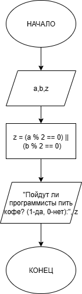
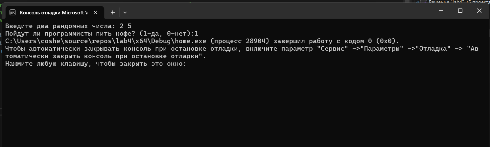

# Домашнее задание к работе 4
## Условие задачи
Два программиста, Анна (A) и Борис (B), дежурят ночью. Чтобы было не так скучно, они решили, что будут пить кофе только если кто-то один из них четный (по номеру своего рабочего места).
Запишите условие для кофе-машины.
## 1. Алгоритм и блок-схема
### Алгоритм
1. Начало
2. Объявить константы:
   - а = Анна.
   - b = Борис.
   - z= расчёт
3. Считаем:
   z = (a % 2 == 0) || (b % 2 == 0);
4. Выводим результаты расчетов:
   -  printf("Пойдут ли программисты пить кофе? (1-да, 0-нет):%d", z);
5. Конец
### Блок-схема

## 2. Реализация программы:
#include <stdio.h>
#include <locale.h>
int main()
{
	setlocale(LC_ALL, "");
	int a, b, z;
	printf("Введите два рандомных числа: ");
	scanf("%d %d", &a, &b);
	z = (a % 2 == 0) || (b % 2 == 0);
	printf("Пойдут ли программисты пить кофе? (1-да, 0-нет):%d", z);
}
## 3. Результат работы программы

## 4. Информация о разработчике
Амелина Юлия, бИПТ-252
